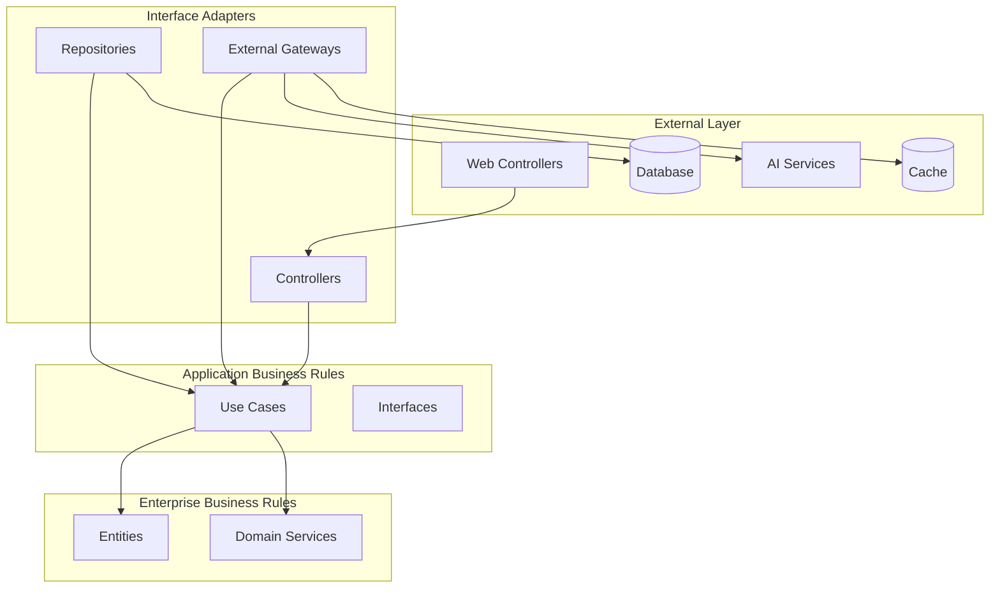

# Clean Architecture Implementation

This document details the Clean Architecture implementation in the AI-Powered Crew Rostering System, explaining the layer structure, dependency rules, and design patterns used.

## 🏗️ Architecture Overview

Clean Architecture organizes the system into concentric layers, with dependencies pointing inward toward the domain. This ensures that business logic remains independent of external concerns like databases, web frameworks, and third-party services.



## 📁 Directory Structure

```
src/
├── domain/                    # Enterprise Business Rules
│   ├── entities/             # Core business entities
│   │   ├── crew.py
│   │   ├── flight.py
│   │   └── roster.py
│   ├── services/             # Domain services
│   │   ├── rostering_service.py
│   │   ├── optimization_engine.py
│   │   └── ai_agent.py
│   └── exceptions/           # Domain exceptions
│       └── __init__.py
├── applications/             # Application Business Rules
│   ├── interfaces/           # Repository interfaces
│   │   └── repository.py
│   └── use_cases/            # Use case implementations
│       ├── generate_roster.py
│       └── handle_disruption.py
└── infrastructure/           # Interface Adapters & External
    ├── api/                  # Web controllers
    │   ├── controllers/
    │   ├── models/
    │   └── routes/
    ├── database/             # Database adapters
    │   ├── core.py
    │   └── repositories.py
    ├── ai/                   # AI service adapters
    │   └── llm_client.py
    ├── logging/              # Logging infrastructure
    └── security/             # Security infrastructure
```

## 🎯 Layer Responsibilities

### 1. Domain Layer (Enterprise Business Rules)

The innermost layer contains the core business logic and entities. This layer is completely independent of external concerns.

#### Entities
```python
# src/domain/entities/crew.py
from dataclasses import dataclass
from datetime import datetime
from typing import List, Optional
from enum import Enum

class CrewRank(str, Enum):
    CAPTAIN = "captain"
    FIRST_OFFICER = "first_officer"
    SENIOR_CABIN_CREW = "senior_cabin_crew"
    CABIN_CREW = "cabin_crew"

@dataclass
class Qualification:
    aircraft_type: str
    certification_date: datetime
    expiry_date: datetime
    proficiency_level: int
    instructor_qualified: bool = False

class Crew:
    def __init__(self, employee_id: str, first_name: str, last_name: str, 
                 rank: CrewRank, base_airport: str):
        self.employee_id = employee_id
        self.first_name = first_name
        self.last_name = last_name
        self.rank = rank
        self.base_airport = base_airport
        self.qualifications: List[Qualification] = []
        self.status = CrewStatus.AVAILABLE
    
    def add_qualification(self, qualification: Qualification) -> None:
        """Add a new qualification to the crew member."""
        self.qualifications.append(qualification)
    
    def has_aircraft_qualification(self, aircraft_type: str) -> bool:
        """Check if crew member is qualified for specific aircraft."""
        return any(
            q.aircraft_type == aircraft_type and 
            q.expiry_date > datetime.utcnow()
            for q in self.qualifications
        )
    
    def is_legal_for_duty(self, flight_duration: float) -> bool:
        """Check if crew member can legally perform duty."""
        # Business logic for duty time limits
        if self.rank in [CrewRank.CAPTAIN, CrewRank.FIRST_OFFICER]:
            return flight_duration <= 8.0  # 8-hour limit for pilots
        return flight_duration <= 10.0  # 10-hour limit for cabin crew
```

#### Domain Services
```python
# src/domain/services/rostering_service.py
from typing import List, Dict, Any
from entities.crew import Crew
from entities.flight import Flight
from entities.roster import Roster

class RosteringService:
    """Core business logic for crew rostering."""
    
    def __init__(self, crew_repo, flight_repo, roster_repo):
        self.crew_repo = crew_repo
        self.flight_repo = flight_repo
        self.roster_repo = roster_repo
    
    async def generate_roster(self, start_date: datetime, end_date: datetime,
                            constraints: List[str]) -> List[Roster]:
        """Generate optimal crew roster for given period."""
        # 1. Fetch available crew and flights
        available_crew = await self.crew_repo.get_available_crew(start_date, end_date)
        flights = await self.flight_repo.get_flights_by_date_range(start_date, end_date)
        
        # 2. Apply business rules and constraints
        valid_assignments = self._apply_business_rules(available_crew, flights, constraints)
        
        # 3. Optimize assignments
        optimized_assignments = self._optimize_assignments(valid_assignments)
        
        # 4. Create roster entities
        roster_assignments = [
            Roster(crew_id=assignment.crew_id, flight_id=assignment.flight_id,
                   duty_start=assignment.duty_start, duty_end=assignment.duty_end)
            for assignment in optimized_assignments
        ]
        
        return roster_assignments
    
    def _apply_business_rules(self, crew: List[Crew], flights: List[Flight], 
                            constraints: List[str]) -> List[Assignment]:
        """Apply business rules and constraints."""
        valid_assignments = []
        
        for flight in flights:
            for crew_member in crew:
                if self._is_valid_assignment(crew_member, flight, constraints):
                    assignment = Assignment(
                        crew_id=crew_member.id,
                        flight_id=flight.id,
                        duty_start=flight.scheduled_departure,
                        duty_end=flight.scheduled_arrival
                    )
                    valid_assignments.append(assignment)
        
        return valid_assignments
    
    def _is_valid_assignment(self, crew: Crew, flight: Flight, 
                           constraints: List[str]) -> bool:
        """Check if assignment is valid according to business rules."""
        # Check aircraft qualification
        if not crew.has_aircraft_qualification(flight.aircraft_type):
            return False
        
        # Check duty time limits
        if not crew.is_legal_for_duty(flight.estimated_flight_time):
            return False
        
        # Check regulatory constraints
        if "dgca_compliance" in constraints:
            if not self._check_dgca_compliance(crew, flight):
                return False
        
        return True
```

### 2. Application Layer (Application Business Rules)

This layer contains use cases and application-specific business rules. It orchestrates the domain layer and coordinates with external systems.

#### Use Cases
```python
# src/applications/use_cases/generate_roster.py
from typing import List, Dict, Any
from pydantic import BaseModel, validator
from datetime import datetime

class GenerateRosterRequest(BaseModel):
    start_date: datetime
    end_date: datetime
    flights: Optional[List[int]] = None
    crews: Optional[List[int]] = None
    constraints: Optional[List[str]] = None
    objectives: Optional[List[str]] = None
    
    @validator("end_date")
    def validate_dates(cls, v, values):
        if "start_date" in values and v <= values["start_date"]:
            raise ValueError("End date must be after start date")
        return v

class GenerateRosterResponse(BaseModel):
    assignments: List[Dict[str, Any]]
    total_cost: float
    efficiency_score: float
    constraint_violations: List[Dict[str, Any]]
    ai_confidence: float
    explanation: str

class GenerateRosterUseCase:
    """Use case for generating crew rosters."""
    
    def __init__(self, rostering_service, ai_agent, optimization_engine):
        self.rostering_service = rostering_service
        self.ai_agent = ai_agent
        self.optimization_engine = optimization_engine
    
    async def execute(self, request: GenerateRosterRequest) -> GenerateRosterResponse:
        """Execute the roster generation use case."""
        try:
            # 1. Validate request
            self._validate_request(request)
            
            # 2. Get AI analysis
            ai_analysis = await self.ai_agent.analyze_requirements(request)
            
            # 3. Generate roster using domain service
            roster_assignments = await self.rostering_service.generate_roster(
                start_date=request.start_date,
                end_date=request.end_date,
                constraints=request.constraints or []
            )
            
            # 4. Optimize using optimization engine
            optimized_roster = await self.optimization_engine.optimize(
                roster_assignments, 
                objectives=request.objectives or []
            )
            
            # 5. Calculate metrics
            total_cost = self._calculate_total_cost(optimized_roster)
            efficiency_score = self._calculate_efficiency(optimized_roster)
            violations = self._check_constraint_violations(optimized_roster)
            
            # 6. Generate explanation
            explanation = await self.ai_agent.explain_roster(optimized_roster)
            
            return GenerateRosterResponse(
                assignments=[assignment.to_dict() for assignment in optimized_roster],
                total_cost=total_cost,
                efficiency_score=efficiency_score,
                constraint_violations=violations,
                ai_confidence=ai_analysis.confidence,
                explanation=explanation
            )
            
        except Exception as e:
            raise ApplicationError(f"Failed to generate roster: {str(e)}")
    
    def _validate_request(self, request: GenerateRosterRequest) -> None:
        """Validate the request parameters."""
        if request.end_date <= request.start_date:
            raise ValidationError("End date must be after start date")
        
        if (request.end_date - request.start_date).days > 30:
            raise ValidationError("Date range cannot exceed 30 days")
    
    def _calculate_total_cost(self, roster: List[Roster]) -> float:
        """Calculate total cost of roster assignments."""
        return sum(assignment.calculate_cost() for assignment in roster)
    
    def _calculate_efficiency(self, roster: List[Roster]) -> float:
        """Calculate efficiency score of roster."""
        if not roster:
            return 0.0
        
        total_assignments = len(roster)
        valid_assignments = sum(1 for assignment in roster if assignment.is_valid())
        return valid_assignments / total_assignments
```

#### Repository Interfaces
```python
# src/applications/interfaces/repository.py
from abc import ABC, abstractmethod
from typing import List, Optional, Dict, Any
from datetime import datetime

class ICrewRepository(ABC):
    """Interface for crew data access."""
    
    @abstractmethod
    async def get_by_id(self, crew_id: int) -> Optional[Crew]:
        """Get crew member by ID."""
        pass
    
    @abstractmethod
    async def get_available_crew(self, start_time: datetime, 
                               end_time: datetime) -> List[Crew]:
        """Get available crew members for time period."""
        pass
    
    @abstractmethod
    async def get_qualified_crew(self, aircraft_type: str) -> List[Crew]:
        """Get crew qualified for specific aircraft."""
        pass
    
    @abstractmethod
    async def save(self, crew: Crew) -> Crew:
        """Save crew member."""
        pass

class IFlightRepository(ABC):
    """Interface for flight data access."""
    
    @abstractmethod
    async def get_flights_by_date_range(self, start_date: datetime,
                                      end_date: datetime) -> List[Flight]:
        """Get flights within date range."""
        pass
    
    @abstractmethod
    async def get_by_id(self, flight_id: int) -> Optional[Flight]:
        """Get flight by ID."""
        pass
    
    @abstractmethod
    async def save(self, flight: Flight) -> Flight:
        """Save flight."""
        pass

class IRosterRepository(ABC):
    """Interface for roster data access."""
    
    @abstractmethod
    async def get_by_crew_and_date(self, crew_id: int, start_date: datetime,
                                 end_date: datetime) -> List[Roster]:
        """Get roster assignments for crew member and date range."""
        pass
    
    @abstractmethod
    async def save(self, roster: Roster) -> Roster:
        """Save roster assignment."""
        pass
    
    @abstractmethod
    async def bulk_save(self, rosters: List[Roster]) -> List[Roster]:
        """Save multiple roster assignments."""
        pass
```

### 3. Infrastructure Layer (Interface Adapters)

This layer contains implementations of interfaces defined in the application layer, adapting external systems to work with the domain.

#### Repository Implementations
```python
# src/infrastructure/database/repositories.py
from sqlalchemy.orm import Session
from typing import List, Optional
from datetime import datetime

from backend.applications.interfaces.repository import ICrewRepository, IFlightRepository
from backend.domain.entities.crew import Crew
from backend.domain.entities.flight import Flight

class CrewRepository(ICrewRepository):
    """PostgreSQL implementation of crew repository."""
    
    def __init__(self, db_session: Session):
        self.db = db_session
    
    async def get_by_id(self, crew_id: int) -> Optional[Crew]:
        """Get crew member by ID."""
        crew_orm = self.db.query(CrewORM).filter(CrewORM.id == crew_id).first()
        if crew_orm:
            return self._to_domain_entity(crew_orm)
        return None
    
    async def get_available_crew(self, start_time: datetime, 
                               end_time: datetime) -> List[Crew]:
        """Get available crew members for time period."""
        crew_orms = self.db.query(CrewORM).filter(
            CrewORM.status == 'available',
            CrewORM.duty_start_time <= start_time,
            CrewORM.duty_end_time >= end_time
        ).all()
        
        return [self._to_domain_entity(crew_orm) for crew_orm in crew_orms]
    
    async def get_qualified_crew(self, aircraft_type: str) -> List[Crew]:
        """Get crew qualified for specific aircraft."""
        crew_orms = self.db.query(CrewORM).filter(
            CrewORM.qualifications.contains([{"aircraft_type": aircraft_type}])
        ).all()
        
        return [self._to_domain_entity(crew_orm) for crew_orm in crew_orms]
    
    async def save(self, crew: Crew) -> Crew:
        """Save crew member."""
        crew_orm = self._to_orm_entity(crew)
        self.db.add(crew_orm)
        self.db.commit()
        self.db.refresh(crew_orm)
        return self._to_domain_entity(crew_orm)
    
    def _to_domain_entity(self, crew_orm: CrewORM) -> Crew:
        """Convert ORM entity to domain entity."""
        return Crew(
            employee_id=crew_orm.employee_id,
            first_name=crew_orm.first_name,
            last_name=crew_orm.last_name,
            rank=CrewRank(crew_orm.rank),
            base_airport=crew_orm.base_airport
        )
    
    def _to_orm_entity(self, crew: Crew) -> CrewORM:
        """Convert domain entity to ORM entity."""
        return CrewORM(
            employee_id=crew.employee_id,
            first_name=crew.first_name,
            last_name=crew.last_name,
            rank=crew.rank.value,
            base_airport=crew.base_airport
        )
```

#### API Controllers
```python
# src/infrastructure/api/controllers/roster_controller.py
from fastapi import APIRouter, Depends, HTTPException
from typing import List

from backend.applications.use_cases.generate_roster import (
    GenerateRosterUseCase, 
    GenerateRosterRequest, 
    GenerateRosterResponse
)
from backend.infrastructure.security.auth import get_current_user

router = APIRouter(prefix="/roster", tags=["roster"])

@router.post("/generate", response_model=GenerateRosterResponse)
async def generate_roster(
    request: GenerateRosterRequest,
    use_case: GenerateRosterUseCase = Depends(get_generate_roster_use_case),
    current_user = Depends(get_current_user)
):
    """Generate crew roster for specified period."""
    try:
        # Check permissions
        if not current_user.has_permission("roster.generate"):
            raise HTTPException(status_code=403, detail="Insufficient permissions")
        
        # Execute use case
        result = await use_case.execute(request)
        
        return result
        
    except ValidationError as e:
        raise HTTPException(status_code=422, detail=str(e))
    except ApplicationError as e:
        raise HTTPException(status_code=400, detail=str(e))
    except Exception as e:
        raise HTTPException(status_code=500, detail="Internal server error")

def get_generate_roster_use_case() -> GenerateRosterUseCase:
    """Dependency injection for use case."""
    # Get dependencies
    crew_repo = get_crew_repository()
    flight_repo = get_flight_repository()
    roster_repo = get_roster_repository()
    ai_agent = get_ai_agent()
    optimization_engine = get_optimization_engine()
    
    # Create domain service
    rostering_service = RosteringService(crew_repo, flight_repo, roster_repo)
    
    # Create use case
    return GenerateRosterUseCase(rostering_service, ai_agent, optimization_engine)
```

## 🔄 Dependency Injection

Clean Architecture relies heavily on dependency injection to maintain loose coupling and testability.

### Dependency Container
```python
# src/infrastructure/container.py
from typing import Dict, Any
from sqlalchemy.orm import Session

class Container:
    """Dependency injection container."""
    
    def __init__(self):
        self._services: Dict[str, Any] = {}
        self._singletons: Dict[str, Any] = {}
    
    def register(self, interface: type, implementation: type, singleton: bool = False):
        """Register a service implementation."""
        self._services[interface.__name__] = {
            'implementation': implementation,
            'singleton': singleton
        }
    
    def get(self, interface: type) -> Any:
        """Get service instance."""
        service_name = interface.__name__
        
        if service_name not in self._services:
            raise ValueError(f"Service {service_name} not registered")
        
        service_config = self._services[service_name]
        
        if service_config['singleton']:
            if service_name not in self._singletons:
                self._singletons[service_name] = self._create_instance(
                    service_config['implementation']
                )
            return self._singletons[service_name]
        
        return self._create_instance(service_config['implementation'])
    
    def _create_instance(self, implementation: type) -> Any:
        """Create instance with dependency injection."""
        # Get constructor parameters
        import inspect
        signature = inspect.signature(implementation.__init__)
        params = {}
        
        for param_name, param in signature.parameters.items():
            if param_name == 'self':
                continue
            
            # Try to resolve dependency
            if param.annotation != inspect.Parameter.empty:
                params[param_name] = self.get(param.annotation)
        
        return implementation(**params)

# Global container instance
container = Container()

# Register services
container.register(ICrewRepository, CrewRepository)
container.register(IFlightRepository, FlightRepository)
container.register(IRosterRepository, RosterRepository)
container.register(RosteringService, RosteringService, singleton=True)
```

## 🧪 Testing Strategy

Clean Architecture makes testing easier by allowing each layer to be tested independently.

### Unit Testing Domain Layer
```python
# tests/unit/test_rostering_service.py
import pytest
from datetime import datetime, timedelta
from unittest.mock import Mock

from src.domain.services.rostering_service import RosteringService
from src.domain.entities.crew import Crew, CrewRank
from src.domain.entities.flight import Flight

class TestRosteringService:
    
    @pytest.fixture
    def mock_repositories(self):
        return {
            'crew_repo': Mock(),
            'flight_repo': Mock(),
            'roster_repo': Mock()
        }
    
    @pytest.fixture
    def rostering_service(self, mock_repositories):
        return RosteringService(
            crew_repo=mock_repositories['crew_repo'],
            flight_repo=mock_repositories['flight_repo'],
            roster_repo=mock_repositories['roster_repo']
        )
    
    @pytest.fixture
    def sample_crew(self):
        return Crew(
            employee_id="EMP001",
            first_name="John",
            last_name="Smith",
            rank=CrewRank.CAPTAIN,
            base_airport="KJFK"
        )
    
    @pytest.fixture
    def sample_flight(self):
        return Flight(
            flight_number="AA100",
            departure_airport="KJFK",
            arrival_airport="KLAX",
            scheduled_departure=datetime.now(),
            scheduled_arrival=datetime.now() + timedelta(hours=5),
            aircraft_type="B737"
        )
    
    async def test_generate_roster_success(self, rostering_service, mock_repositories, 
                                         sample_crew, sample_flight):
        """Test successful roster generation."""
        # Arrange
        start_date = datetime.now()
        end_date = start_date + timedelta(days=7)
        
        mock_repositories['crew_repo'].get_available_crew.return_value = [sample_crew]
        mock_repositories['flight_repo'].get_flights_by_date_range.return_value = [sample_flight]
        
        # Act
        result = await rostering_service.generate_roster(start_date, end_date, [])
        
        # Assert
        assert len(result) > 0
        mock_repositories['crew_repo'].get_available_crew.assert_called_once()
        mock_repositories['flight_repo'].get_flights_by_date_range.assert_called_once()
    
    def test_is_valid_assignment(self, rostering_service, sample_crew, sample_flight):
        """Test assignment validation logic."""
        # Arrange
        sample_crew.add_qualification(Qualification(
            aircraft_type="B737",
            certification_date=datetime.now() - timedelta(days=30),
            expiry_date=datetime.now() + timedelta(days=365),
            proficiency_level=5
        ))
        
        # Act
        is_valid = rostering_service._is_valid_assignment(
            sample_crew, sample_flight, ["dgca_compliance"]
        )
        
        # Assert
        assert is_valid is True
```

### Integration Testing
```python
# tests/integration/test_roster_generation.py
import pytest
from datetime import datetime, timedelta

from src.applications.use_cases.generate_roster import GenerateRosterUseCase
from src.infrastructure.database.repositories import CrewRepository, FlightRepository

class TestRosterGenerationIntegration:
    
    @pytest.fixture
    async def use_case(self, db_session):
        """Create use case with real repositories."""
        crew_repo = CrewRepository(db_session)
        flight_repo = FlightRepository(db_session)
        # ... other dependencies
        
        return GenerateRosterUseCase(crew_repo, flight_repo, ...)
    
    async def test_end_to_end_roster_generation(self, use_case):
        """Test complete roster generation flow."""
        # Arrange
        request = GenerateRosterRequest(
            start_date=datetime.now(),
            end_date=datetime.now() + timedelta(days=7),
            constraints=["dgca_compliance"],
            objectives=["minimize_cost"]
        )
        
        # Act
        result = await use_case.execute(request)
        
        # Assert
        assert result.assignments is not None
        assert result.total_cost > 0
        assert 0 <= result.efficiency_score <= 1
        assert result.ai_confidence > 0
```

## 🔧 Benefits of Clean Architecture

### 1. Independence
- **Framework Independence**: Business logic doesn't depend on FastAPI, SQLAlchemy, etc.
- **Database Independence**: Can switch from PostgreSQL to MongoDB without changing business logic
- **UI Independence**: Can add web UI, mobile app, or CLI without changing core logic
- **External Service Independence**: Can switch AI providers without affecting business rules

### 2. Testability
- **Unit Testing**: Each layer can be tested independently with mocks
- **Integration Testing**: Test interactions between layers
- **Business Logic Testing**: Test core business rules without external dependencies
- **Fast Tests**: Unit tests run quickly without database or network calls

### 3. Maintainability
- **Clear Separation**: Each layer has a single responsibility
- **Easy Changes**: Changes in one layer don't affect others
- **Code Organization**: Related code is grouped together
- **Documentation**: Architecture serves as living documentation

### 4. Flexibility
- **Technology Changes**: Easy to adopt new technologies
- **Feature Addition**: New features can be added without affecting existing code
- **Scaling**: Can scale different layers independently
- **Deployment**: Can deploy different layers separately

## 🚀 Implementation Guidelines

### 1. Dependency Rule
- Dependencies must point inward toward the domain
- Outer layers can depend on inner layers, but not vice versa
- Use dependency injection to invert dependencies

### 2. Interface Segregation
- Define interfaces in the application layer
- Implement interfaces in the infrastructure layer
- Keep interfaces focused and cohesive

### 3. Single Responsibility
- Each class should have one reason to change
- Separate concerns into different classes
- Keep methods focused on single tasks

### 4. Open/Closed Principle
- Open for extension, closed for modification
- Use interfaces and abstractions
- Add new features by extending, not modifying

### 5. Dependency Inversion
- Depend on abstractions, not concretions
- Use dependency injection containers
- Invert control to the framework

This Clean Architecture implementation provides a solid foundation for the AI-Powered Crew Rostering System, ensuring maintainability, testability, and flexibility while keeping the core business logic independent of external concerns.
